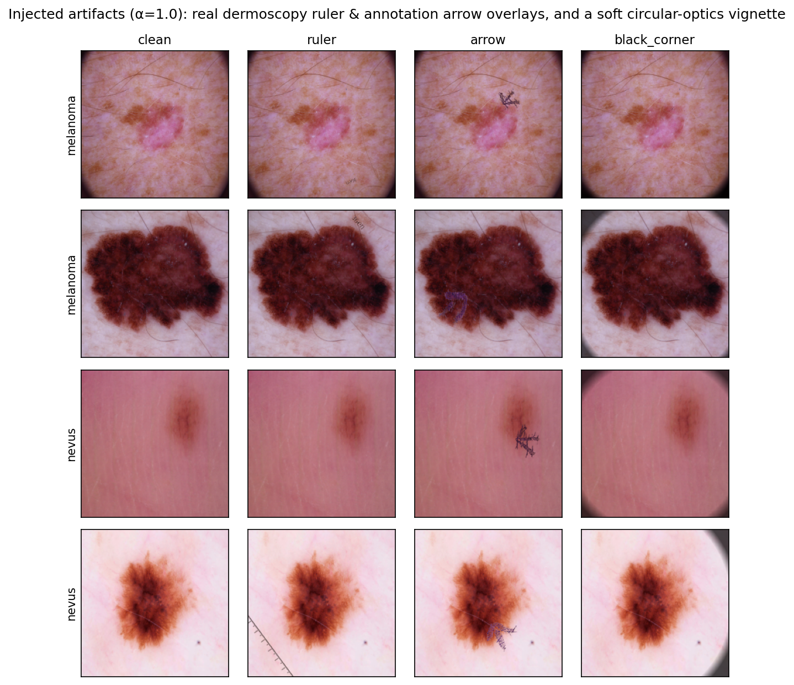
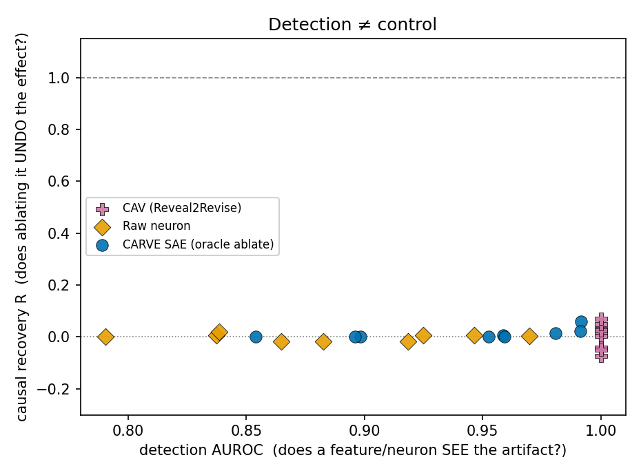
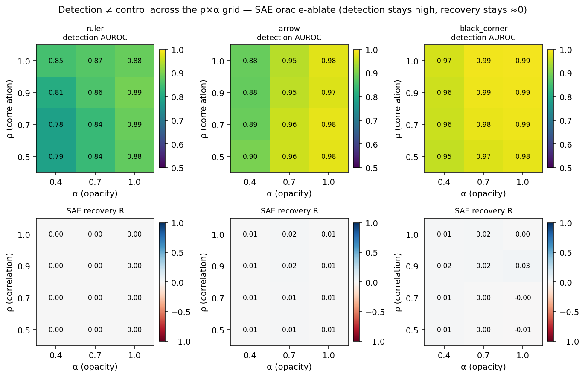
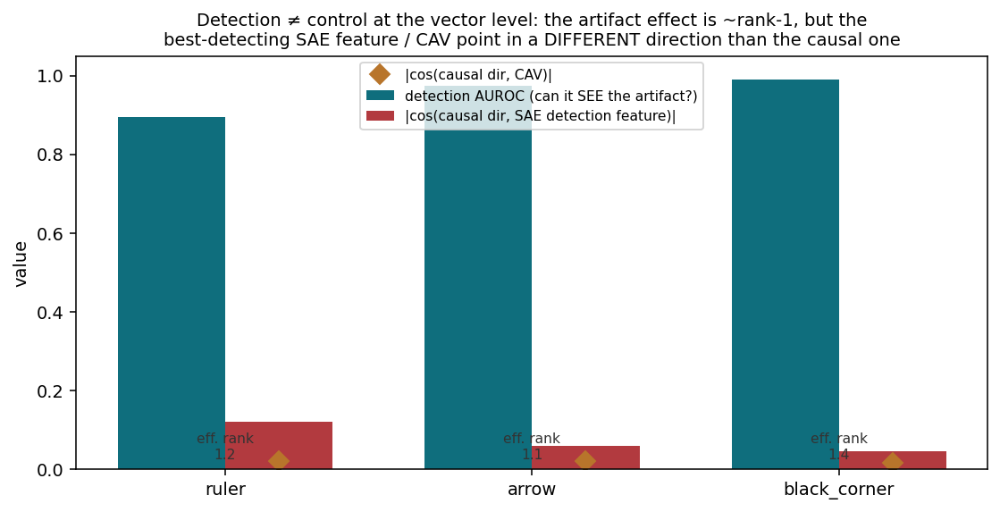

<!-- WRITER NOTE (ELI10): This is a FIRST DRAFT. Every number here is copied from docs/PROGRESS.md
     with the run directory noted next to it. If you change a number, change the citation. Never add
     a number that isn't traceable to a run dir. The whole paper has ONE big idea: tools can SPOT the
     junk in the picture but can't SWITCH IT OFF. Keep hammering that one idea. -->

<!-- WRITER NOTE (ELI10): Target venue = ISIC Skin Image Analysis Workshop @ MICCAI 2026 (a skin-imaging
     audience). Fallback = MI4MedFM (medical foundation-model reliability). So: lead with the dermatology
     reliability angle (rulers/ink/vignettes fooling dermoscopy AI), but don't bury the general
     "detection ≠ control" message so deep that it can't be re-pitched to MI4MedFM. -->

# CARVE: A Causal Benchmark Showing that Interpretability Can Detect but Cannot Control Artifact Bias in Dermoscopy Foundation Models

**Authors (placeholder):** Bartłomiej Moniak, Filip Noworolnik (AGH University of Kraków)

<!-- WRITER NOTE (ELI10): Author order / affiliations are placeholders — confirm with the PI. Do NOT list
     any AI tool as an author. CLAUDE.md names Filip Noworolnik as PI; Bartlomiej Moniak froze the prereg. -->

---

## Abstract

Dermoscopy classifiers are known to latch onto imaging artifacts — surgical ink, rulers, and the dark
vignette of the dermoscope's field of view — instead of the lesion itself, a reliability failure with
direct clinical consequences. A growing line of work proposes to *fix* this with interpretability:
find the internal feature that encodes the artifact, then switch it off. We ask a sharper question:
when such a feature is switched off, does the model's decision actually return to what it would have
been on a clean image? To answer it rigorously we need to *own* the clean counterfactual. CARVE
(*Causal ARtifact Validation of Encodings*) therefore **injects** a known artifact into otherwise
clean dermoscopy images, so the exact clean twin of every contaminated image is available for free.
This lets us grade any intervention against a gold standard: erasing the artifact from the input
recovers the clean decision perfectly by construction. On MONET, a dermatology CLIP foundation model,
we train sparse autoencoders (SAEs) on clean activations and benchmark SAE feature ablation and
steering against a concept-activation-vector baseline (CAV / Reveal2Revise), budget-matched raw-neuron
ablation, and a DermFM-Zero-style top-k suppression baseline, all on the *same* injected ground truth.
The result is a clean and consistent dissociation. **Every method detects the artifact almost
perfectly** (detection AUROC up to 1.0), **but none can control it**: causal recovery `R` sits at
about 0, while input-level erasure recovers `R = 1.0`. The gap survives a fair-shot stress test
(ablating 20× more features, or handing steering a per-image best-case strength) and holds in every
cell of a pre-registered correlation-strength × opacity grid. A mechanism analysis explains why: the
artifact's causal effect on the activation is essentially one direction (effective rank 1.1–1.4), but the
direction each tool uses to *detect* it is nearly orthogonal to that causal direction — so "detection ≠
control" is literally true at the level of vectors. We conclude that high artifact-detection scores do
not license claims of artifact *removal*, and we release CARVE as a controlled benchmark for measuring
the difference.

<!-- WRITER NOTE (ELI10): The abstract must contain the three-beat story: (1) what we set out to do
     (test if interpretability can UNDO artifact bias), (2) HOW (inject the artifact, so we own the
     clean twin, then grade recovery), (3) WHAT WE GOT (detects yes, controls no). The negative result
     IS the contribution — say it plainly and confidently, not apologetically. -->

---

## 1. Introduction

Automated dermoscopy has repeatedly been shown to make the right diagnosis for the wrong reason.
Winkler et al. reported that adding a surgical skin marking to dermoscopic images dropped a
CNN's specificity from 84% to 46% [Winkler2019]. Bissoto et al. [Bissoto2019] catalogued how
artifacts — rulers, ink, hair, dark corners, gel bubbles, colored patches — pervade the standard ISIC
benchmark and co-occur with the diagnostic label: colored patches, for instance, sit on roughly 46% of
benign but 0% of malignant images in one analysis, so a classifier that simply detects the patch scores
well without ever looking at the lesion. This is a textbook spurious correlation, and it is exactly the
kind of failure a clinician needs a decision-support tool *not* to have.

The community's emerging response is interpretability-based debiasing. Concept-activation methods
(TCAV, and its clinical use in Reveal2Revise / ClArC [Pahde2025]) learn a direction in activation space
that separates artifact-present from artifact-absent images and then project it out. More recently,
sparse autoencoders (SAEs) — which decompose a model's internal activations into many sparse, human-
readable features — have been used to discover an "artifact feature" and suppress it. DermFM-Zero
[DermFMZero2026] does precisely this on a dermatology foundation model: it identifies the top neurons
activated by each artifact type, zeroes them at inference, and reports diagnostic-AUROC gains of 12–38%.

<!-- WRITER NOTE (ELI10): DermFM-Zero is BOTH our motivation and our closest competitor. Cite it
     generously and respectfully. We are NOT saying "muting artifact features improves diagnosis" —
     they published that. We ARE saying "nobody CHECKED, on a known answer key, whether the muting
     truly removes the artifact's causal effect, how selective it is, and whether a plain neuron would
     do the same." See docs/NOVELTY.md — this distinction is binding. Reviewer risk: we may be reviewed
     by the same group, so stay generous. -->

There is a hidden inferential leap in this story. On natural images the artifact's *true* causal effect
on the decision is unknown — there is no clean version of that same image to compare against — so
"the AUROC went up after we muted the feature" is at best circumstantial evidence that the intervention
removed the artifact's influence, and at worst compatible with the intervention simply damaging the
model in a helpful-on-average direction. **Detecting the artifact and controlling it are different
claims, and the literature largely conflates them.**

CARVE closes this gap by manufacturing the missing counterfactual. We take verified-clean dermoscopy
images and *inject* an artifact ourselves at a chosen opacity and placement. Because we did the
injection, the clean twin of every contaminated image is available on demand: removing the artifact
from the input yields the exact clean decision. This gives us a per-image, input-level gold measurement
of the artifact's causal effect, and against it we can grade any feature-level intervention with three
questions: does switching the feature off **recover** the clean decision; does it act **selectively**
on contaminated images and leave clean ones alone; and what **off-target** damage does it do to the
clean task? We run these measurements for SAE ablation and steering and for the incumbent baselines on
identical ground truth.

Our central finding is a dissociation, and we report it as the result rather than an obstacle. Across
three artifact families, three seeds, and a pre-registered grid of operating points, **every method
detects the injected artifact almost perfectly, and none controls it.** Feature-level causal recovery
`R` is ≈ 0 while input-level erasure achieves `R = 1.0`. The one method that does move the decision
(DermFM-Zero-style suppression) does so erratically, pushing the wrong way on most artifacts and
damaging the clean task. This is not a failure of our setup — input erasure recovers perfectly, so the
recoverable signal is really there — but a finding about the interpretability tools.

**Contributions.**

- **A controlled causal benchmark for artifact debiasing in dermoscopy.** CARVE injects known
  artifacts to own the clean counterfactual, turning correlational "we muted the feature" claims into
  measurable causal quantities: recovery `R`, selectivity, and off-target damage, all graded against an
  input-removal oracle. To our knowledge this is the first controlled causal validation of SAE-feature
  interpretability on a medical foundation model.
- **A head-to-head, apples-to-apples comparison** of SAE ablation and steering against CAV /
  Reveal2Revise, budget-matched raw-neuron ablation, a DermFM-Zero-style top-k suppression baseline,
  and random-feature and input-removal controls — all on the *same* images, splits, and metrics.
- **The detection ≠ control result**, replicated on realistic photo-overlay rulers and arrows and a
  physically faithful soft dermoscope vignette, shown to survive a fair-shot stress test (20× more
  features; best-case per-image steering), and confirmed pre-registered across a correlation-strength ×
  opacity grid.
- **A geometric mechanism for the gap.** The artifact's causal effect on the activation is essentially
  one direction (effective rank 1.1–1.4), yet the direction each tool uses to *detect* it is nearly
  orthogonal to that causal direction (`|cos|` ≈ 0.02–0.12) — so "detection ≠ control" is literally true
  at the level of vectors.
- **A released, method-agnostic harness** (injection recipe, split indices, metrics) so any future
  debiasing method can be scored on the same answer key.

<!-- WRITER NOTE (ELI10): The contributions bullets are the spine reviewers will skim. Keep the FIRST
     bullet the strongest (the benchmark idea), and make sure NOT to over-claim: we say "first
     controlled causal validation of SAE interpretability on a medical FM" — that is the NOVELTY.md
     wording, safe. We do NOT claim "first SAE in dermatology" (DermFM-Zero and others predate us). -->

---

## 2. Related Work

**Artifact bias in dermoscopy.** The shortcut-learning problem is canonical. Winkler et al.
[Winkler2019] quantified the marker-ink effect; Bissoto et al. [Bissoto2019] released per-image
artifact annotations on ISIC 2018 and the Interactive Atlas and showed the correlations that make the
shortcut available. Follow-up work cautioned that naive debiasing does not straightforwardly fix the
problem [DebiasNotSoFast2020 — CITE — verify]. CARVE takes the same artifact taxonomy (ruler, ink,
dark corner) but manufactures the correlation under our control so that the counterfactual is exact.

**SAEs on medical encoders.** SAEs are now established on medical foundation models: pathology
[PathAI2024], mammography [MammoSAE2025], and radiology multimodal LLMs [MAIRA2SAE2025], with further
reports in chest X-ray [SAERad2024 — CITE — verify], hematology [CytoSAE2025 — CITE — verify], and
MedCLIP [MedSAE2025 — CITE — verify]. We are therefore *not* claiming the first SAE in medical imaging;
we are asking whether such features support *causal control*, not just discovery.

**Interpretability-based artifact mitigation (our baselines).** Reveal2Revise / ClArC [Pahde2025] uses
CAVs (built on TCAV [TCAV — CITE — verify]) to detect and unlearn artifact concepts; CDEP [Rieger2020]
penalizes explanations to steer models away from spurious regions; SAE steering has been used to remove
spurious correlations in CLIP ViTs on Waterbirds [SteerCLIPSAE2025]. DermFM-Zero [DermFMZero2026] is the
closest work: it discovers artifact features on a dermatology encoder with an SAE and suppresses the
top-k neurons, reporting downstream AUROC gains. We reimplement its top-k suppression as a baseline
(its weights are not public) and evaluate all of these methods on our controlled answer key.

<!-- WRITER NOTE (ELI10): The point of this paragraph is: "the methods we test are the field's actual
     debiasing tools, run fairly." Make sure the reader sees we didn't cherry-pick a weak baseline —
     CAV/Reveal2Revise and DermFM-Zero are the state of the art for this exact task. -->

**Causal / synthetic validation of SAEs.** Our methodology sits next to a line of work that builds
ground truth to test SAEs: RAVEL [RAVEL2024] defines "cause" and "isolation/off-target" metrics on
natural LLM attributes; SynthSAEBench [SynthSAEBench2026] and Sanity Checks for SAEs [SanityChecks2026]
use synthetic dictionaries (the latter finding SAEs recover only ~9% of ground-truth features);
TAPAScore [TAPAScore2026] measures causal selectivity on synthetic CUB/COCO; and sparse feature
circuits [SparseCircuits2024] trace causal edges between SAE features in language models. CARVE fills a
specific gap in this neighborhood: **medical vision, injected artifacts, and downstream-decision
steering** (not activation-level recovery only, and not natural-image attributes).

<!-- WRITER NOTE (ELI10): This paragraph is where a skeptical reviewer looks to say "this is just RAVEL
     for derm." Pre-empt it: our novelty vs. these is (a) medical foundation model, (b) injected
     artifacts with a per-image input-level answer key, (c) grading DOWNSTREAM decision recovery, not
     just how well the SAE reconstructs an activation. Keep that triple distinction crisp. -->

**Tooling.** We build interventions on ViT-Prisma [ViTPrisma2025] (hooked ViT, activation patching,
pretrained CLIP/DINO SAEs).

---

## 3. The CARVE Benchmark

<!-- WRITER NOTE (ELI10): This section answers "HOW did you try to do it?" Keep it concrete: injection,
     the gold counterfactual, the five metrics (define each in ONE plain sentence before using it),
     the interventions, and the baselines. A skin-imaging reader should be able to reimplement the idea
     from this section alone. -->

### 3.1 Controlled injection and the gold counterfactual

The core trick is that we own the answer key. For a clean image `x`, `add(x)` pastes the artifact in at
a chosen opacity `α` and (seeded) placement, and `remove(x_art)` returns the exact clean source. Because
each paste is seeded by the image index, `x_art` is byte-for-byte reproducible across runs. We inject
three artifact families (Section 4). The injected artifact is never seen during SAE training — the SAE
is trained only on clean activations — so the feature we later probe is one of MONET's *own* natural
features that happens to respond to the artifact, not a feature we planted.

To manufacture a controllable bias we build a ρ-biased set: the artifact is pasted so that
`P(present | melanoma) = ρ` and `P(present | nevus) = 1 − ρ`. This is the tunable spurious correlation
a lazy model would exploit, and it gives the feature-selection split a clean present/absent detection
signal. Crucially, at *evaluation* we do not rely on any correlation: we paste the artifact onto
**every** clean eval image and compare it against its own clean twin, so recovery is measured
per-image.

**[FIGURE 1: injected-artifact examples montage — dermoscopy images shown clean vs. with injected
ruler, arrow, and black_corner (soft dermoscope vignette) overlays. Source:
`experiments/overlay_examples/verification_new_set.png` / `contact_sheet.png`.]**

*Figure 1. The three injected artifacts. Left to right: a real dermoscopy-ruler photo pasted at a
random position, size, and angle; a real annotation arrow pointing at the lesion; and a physically
faithful soft dermoscope vignette (circular optics over a rectangular sensor, ≤ 2.8% coverage). For
each contaminated image the exact clean source is available, which is what makes recovery measurable.*

<!-- WRITER NOTE (ELI10): This figure sells the whole premise ("we paste, so we own the clean twin").
     Pick 3-4 clean rows with each artifact and its clean original side by side. Double-check the soft
     black_corner reads as SUBTLE — that subtlety is the point of the 2026-07-09 redesign (§5 of
     PROGRESS): the old hard disc blacked out ~21% and was unrealistically blunt. -->

### 3.2 The decision signal and the five metrics

The model's decision signal `f(·)` is the melanoma-vs-nevus **logit margin** `z_pos − z_neg`; every
effect below is a difference in `f`. We define each metric in one sentence before using it.

- **Input-level (gold) effect** `e_in(x_art) = f(x_art) − f(remove(x_art))` — how much the artifact
  moves the decision, measured by removing it from the *input*; this is the ground truth every
  feature-level intervention is graded against.
- **Bias gap** = accuracy on artifact-aligned images minus accuracy on artifact-conflicting images —
  how much the model *relies* on the shortcut (≈ 0 means nothing to recover).
- **Detection AUROC** = how well the candidate feature's activation separates artifact-present from
  artifact-absent images on the selection split — i.e., can the tool even *spot* the artifact.
- **Causal recovery** `R = 1 − |f_{−S}(x_art) − f(remove(x_art))| / |e_in|` — how much of the
  artifact's true effect switching off the feature `S` reproduces: `R = 1` is perfect recovery, `R = 0`
  is no recovery, `R < 0` is overshoot in the wrong direction. Images with `|e_in| < ε = 10⁻³` are
  skipped.
- **Selectivity** = Cause / (Cause + Isolation), where Cause is the mean effect of the intervention on
  artifact cases and Isolation is its mean effect on clean cases — 1.0 means the intervention touches
  only contaminated images.
- **Off-target** = clean-task accuracy before minus after the intervention — the collateral damage to
  the normal diagnosis (lower is better).

<!-- WRITER NOTE (ELI10): These six one-liners are the most important prose in the paper for clarity.
     A reviewer must never have to guess what R means. If you trim anything for space, DON'T trim these
     definitions. Recovery R is the headline; make it unmissable. -->

### 3.3 Interventions and baselines

All interventions act at layer ℓ = 12 with the *input unchanged*; they differ only in what direction
`S` they act on and how. **Ablate** zeroes the feature's reconstructed contribution; **steer**
subtracts `c · Σ unit-decoder(S)` with a swept coefficient `c` (sign fixed in pre-registration, so it
is never re-chosen after seeing results). Every method is pushed through one shared interface onto the
*same* `x_art`/`x_clean` pair and the same selection split, which is what makes the comparison
apples-to-apples rather than five separate experiments.

- **SAE oracle-ablate (ours):** zero the single top-detection-AUROC SAE feature (selected on `select`).
- **SAE steering (ours):** subtract the feature's decoder direction with coefficient `c`, sweeping `c`.
- **Raw neuron (budget-matched):** ablate the top-detection-AUROC raw neuron — the "does the fancy SAE
  beat one neuron?" control.
- **CAV / Reveal2Revise:** learn a class-weighted logistic direction separating artifact present/absent
  and project activations back to their clean level along it (`a′ = a − (a·û − b)·û`).
- **DermFM-Zero top-5 (incumbent):** zero the five neurons most activated by the artifact, following
  the published method (reimplemented; their weights are private).
- **Random-feature control** and **input-removal oracle** (the `R = 1` ceiling).

<!-- WRITER NOTE (ELI10): The raw-neuron and CAV baselines are our answer to killer objection #2
     ("what does a lossy SAE add over a plain neuron / a concept vector?"). Make sure the reader
     understands these are budget-matched and run on identical ground truth, so any SAE advantage
     (or lack of one) is real. -->

---

## 4. Experimental Setup

**Model.** MONET (Kim et al., dermatology CLIP ViT-L/14, 24 blocks, d = 1024, public weights), frozen
encoder. We use two bias-measurement arms: the **zero-shot arm** (no trained head — MONET answers
melanoma-vs-nevus via text prompts, giving the cleanest possible ground truth, and the headline arm for
Section 5) and the **induced-probe arm** (a class-weighted logistic probe trained on a ρ-biased set —
the tougher stress-test version used for the bias-gap column).

**Data and task.** HAM10000 / ISIC-2018 Task 3, reduced to melanoma (+) vs nevus (−), n = 7,818
(MEL 1,113 / NV 6,705, ≈ 6:1 imbalance). Public + synthetic data only; the injection recipe pastes
artifacts onto verified-clean images. Class imbalance is handled with stratified splits and class
weighting.

**Splits (seeded, stratified, pairwise-disjoint, asserted in code).** probe_train 0.40, sae_train 0.25,
select 0.10, eval 0.15, test 0.10. The rule we do not break: the images used to *select* a feature must
not overlap with the images used to *measure* its effect, and neither may overlap with probe training —
otherwise "this feature controls the artifact" is just the model remembering the selection images.

**Artifacts.** Two artifact sets are reported. The original synthetic set (hand-drawn ruler, ink dot,
smooth dark-corner vignette) established the pipeline; the **realistic set** used for the headline
results is: **ruler** (a real dermoscopy-ruler photo pasted at random position/size/angle), **arrow**
(a real annotation arrow pointing at the lesion), and **black_corner** (a physically faithful soft
dermoscope vignette from circular optics over a rectangular sensor, coverage ≤ 2.8%). The soft
black_corner replaced an earlier hard inscribed-circle disc that blacked out ~21% of the image; a check
of the training set showed only 1.9% of the 10,015 HAM10000 images carry any real vignette and a full
circle is essentially absent (0.03%), so the hard disc was an unrealistically blunt cue.

<!-- WRITER NOTE (ELI10): The black_corner redesign is a strength, not a wart — it shows we corrected an
     unrealistic artifact toward physical faithfulness and the result STILL held. Say it as diligence.
     Numbers (1.9%, 0.03%, ≤2.8%, ~21%) come straight from PROGRESS §5. Double-check them at write time. -->

**Pre-registration and SAE.** Metrics, hypotheses, and selection rules were frozen before the final
grid (PREREGISTRATION.md, git `0840de8`, 2026-07-03). SAE: TopK in the raw residual stream, k = 32,
unit-norm decoder, AuxK dead-feature revival on. The **width rule** is fixed as: the widest dictionary
with held-out dead-feature fraction ≤ 15% and R² ≥ 0.98. The exploratory grids (Section 5.1–5.3) ran at
width 16384 (≈ 22% dead — fails the bar, so those are labelled robustness/exploratory); the
**pre-registered confirmatory sweep (Section 5.4) runs at the rule-compliant width 4096** (6.9–8.9%
dead, R² = 0.990). The dissociation is identical at both widths. Feature-set size m = 1 for the primary
analysis. Headline numbers are mean ± std over seeds [0, 1, 2].

<!-- WRITER NOTE (ELI10): The width story is subtle but IMPORTANT for prereg-compliance. In plain terms:
     the pretty exploratory numbers used a very wide SAE that is a bit "unhealthy" (too many dead
     features), so the REGISTERED headline uses the narrower, healthy width-4096 SAE. Both give the same
     answer. If a reviewer challenges "you tuned the SAE," this paragraph is the defense — keep it. -->

**Reproducibility.** Every run writes its resolved config, seed, and per-image outputs to a timestamped
directory; aggregation reads from disk, never from memory. Run directories are cited per result below.

---

## 5. Results

<!-- WRITER NOTE (ELI10): The results section is the three-beat payoff. 5.1 = "the bias is real"
     (otherwise there's nothing to recover). 5.2 = the headline dissociation. 5.3 = "we gave the tools
     their fairest shot and it still holds." 5.4 = "it holds everywhere in the grid." Keep each
     subsection ending on the same drumbeat: detect yes, control no. -->

### 5.1 The injected bias is real and behaves sensibly

Before asking whether interpretability can undo the bias, we confirm the bias exists. Editing MONET's
internal activity at layer 12 shifts the melanoma-vs-nevus margin by 1.56 (a random edit shifts it 1.83),
so the model's internals genuinely drive its output — the precondition for the whole study.

For the realistic artifact set, at the strongest operating point (ρ = 1, α = 1, layer 12), each mark
bends MONET's zero-shot decision as follows.

**[TABLE 1: injected-artifact bias, realistic set. Source: PROGRESS §5.1, Phase-0 run
`experiments/runs/20260709T185640Z_phase0_gate`.]**

| Artifact | zero-shot `e_in` (median, CI95) | direction | induced-probe bias_gap |
|---|---|---|---|
| ruler | **+0.18** [+0.09, +0.30] | → melanoma (68% of images) | 0.32 |
| arrow | **+0.71** [+0.58, +0.83] | → melanoma (93%) | 0.68 |
| black_corner | **+0.23** [+0.14, +0.32] | → melanoma (68%) | 0.87 |

All three realistic marks push toward *melanoma*. The real ruler is a weak, subtle cue (small `e_in`,
bias_gap 0.32) — real rulers are thin and sit off to the side. The realistic black_corner is only a
*moderate* cue for the zero-shot model (`e_in` +0.23, down from +0.72 for the old blunt disc), yet a
*trained probe* still exploits it heavily (bias_gap 0.87): a soft corner darkening is a reliable,
easily-detected tag that a lazy classifier grabs even though it shifts the raw decision little. For
reference, the original synthetic set behaved sensibly too — shrinking the ink mark to a dot roughly
halved its effect (`e_in` +0.96 → +0.49) — and MONET's clean-task accuracy is 0.92.

<!-- WRITER NOTE (ELI10): The interesting nuance here is that the probe's bias_gap (0.87) is HIGH even
     though the zero-shot e_in (0.23) is only moderate — a lazy classifier over-uses an easy-to-spot
     tag. This is a nice dermatology-reliability point worth one sentence in the discussion too. Don't
     overstate the zero-shot black_corner effect; it is deliberately subtle now. -->

### 5.2 Detection ≠ control: every method detects the artifact, none controls it

This is the headline. Setup: MONET zero-shot arm, ρ = 0.9, α = 1.0, layer 12, width-16384 SAE, 250 eval
images, 3 seeds, all methods on the same images and splits. `R` = recovery (1 = fully undoes the
artifact's effect, 0 = does nothing). The three R values below are ruler / arrow / black_corner.

**[TABLE 2: detection vs. control, realistic artifact set. Source: PROGRESS §5.2, run
`experiments/runs/20260709T195504Z_baselines_grid`.]**

| Method | detection AUROC | recovery R (mean±std) | selectivity | off-target |
|---|---|---|---|---|
| **input-removal oracle** (ceiling) | — | **1.00 ± 0.00** | 1.00 | 0.00 |
| **SAE oracle-ablate** (ours) | 0.88–0.99 | **≈0** (+.00 / +.00 / +.03) | 0.87–0.99 | 0.00 |
| raw neuron (budget-matched) | 0.82–0.95 | **≈0** (−.01 / −.01 / −.01) | 0.48–0.52 | ~0 |
| CAV (Reveal2Revise) | 1.000 | **≈0** (−.05 / +.02 / +.05) | 0.52–0.69 | ~0–.03 |
| DermFM-Zero top-5 (incumbent) | — | **erratic / harmful** (−1.07 / −.39 / −.92) | 0.46–0.50 | **0.13** |
| random raw (control) | — | ≈0 (+.00 / +.00 / +.00) | 0.27–0.35 | ~0 |

**[FIGURE 2: "Detection ≠ control" scatter — detection AUROC (x) vs. recovery R (y) for every method;
all points cluster at high AUROC / R≈0 except the input-removal oracle at R=1. Source:
`experiments/runs/20260709T195504Z_baselines_grid/figures/detection_vs_recovery.png`.]**

*Figure 2. Detection is easy, control is not. Every interpretability method lands at high detection
AUROC but recovery near zero; only input-level erasure reaches R = 1.*

Every interpretability tool detects the mark well (AUROC up to 1.0), but none undoes it (R ≈ 0), while
erasing the mark from the input undoes it perfectly (R = 1.0). Several points sharpen the story:

- **The SAE's only edge over a single raw neuron is selectivity, not control.** The SAE ablation reaches
  0.87–0.99 selectivity versus 0.48–0.52 for the raw neuron, but both recover ≈ 0. So the fancy SAE buys
  near-perfect selectivity — and no more actual control than one neuron.
- **CAV, a full learned direction, also fails to control** (R ≈ 0 across artifacts), with selectivity
  (0.52–0.69) between the neuron and the SAE. No straight-line method — sparse feature, raw neuron, or
  concept vector — attains selective causal control.
- **The one method that moves the decision does it badly.** DermFM-Zero-style suppression is erratic and
  *harmful*: it pushes the wrong way on ruler (−1.07) and black_corner (−0.92), is sloppy
  (selectivity ~0.46–0.50), and damages the clean task by 13%. A downstream-AUROC number alone would
  hide all of this — which is exactly the gap CARVE's controlled answer key exposes.
- **Steering doesn't rescue ablation — it overshoots.** Turning the feature down harder pushes the
  answer past clean into the wrong direction (at the strongest setting c = 16: ruler R = −3.4,
  black_corner R = −2.2; arrow peaks at only +0.10 then falls to −0.38).

The SAE was healthy for this grid (R² ≈ 0.991, ~22–23% dead features, consistent across seeds), so the
result is not an artifact of a starved dictionary. It also reproduced on the original synthetic set (see
Table 4, appendix), where the same gap held on a healthy width-4096 SAE (9.6% dead).

<!-- WRITER NOTE (ELI10): This is the strongest part of the paper — present it with confidence. The most
     persuasive single sentence: "erasing the mark recovers R=1.0, so the signal IS recoverable; the
     tools just can't reach it." The DermFM-Zero row is the rhetorical high point vs. the incumbent —
     but stay fair and factual (it's their published method, reimplemented; we test it on OUR answer
     key). Do NOT editorialize beyond the numbers. -->

**[FIGURE 4 (optional): recovery bars per method/artifact and a selectivity-vs-off-target panel. Source:
`.../figures/recovery_bars.png` and `.../figures/selectivity_vs_offtarget.png`.]**

*Figure 4. Left: recovery R by method and artifact, with the input-removal ceiling at 1.0. Right:
selectivity vs. off-target — the SAE's near-perfect selectivity buys no additional control.*

### 5.3 Fair-shot stress test: more features and best-case steering still fail

The obvious rebuttal to Section 5.2 is "you switched off only one feature and picked a bad steering
strength." So we gave the tools their fairest shot on the realistic set (ρ = 0.9, α = 1.0, width 16384,
3 seeds): (#1) ablate the top-*m* artifact features together for m ∈ {1, 3, 5, 10, 20}; (#2) give each
image its *own* best steering strength — a per-image oracle coefficient that no real single-strength
method can beat.

**[TABLE 3: fair-shot stress test. Source: PROGRESS §5.3, run
`experiments/runs/20260709T185808Z_interventions_grid`.]**

*Ablating more features (recovery R, mean±std; selectivity m=1→m=20):*

| Artifact | m=1 | m=5 | m=20 | selectivity m=1→m=20 |
|---|---|---|---|---|
| arrow | +0.00 | +0.04 | **+0.12** ±0.06 | 0.99 → 0.91 |
| ruler | +0.00 | +0.02 | **+0.07** ±0.01 | 0.87 → 0.82 |
| black_corner | +0.03 | +0.07 | **+0.14** ±0.05 | 0.95 → 0.92 |

*Best-case (per-image oracle) steering:*

| Artifact | fixed-strength curve (peak → overshoot) | best-case per-image oracle |
|---|---|---|
| arrow | peaks +0.10 (c≈1) → −0.38 (c=16) | **+0.78** ±0.09 (sel 0.66) |
| ruler | −0.12 (c=0.5) → **−3.4** (c=16) | **+0.33** ±0.44 (sel 0.54) |
| black_corner | +0.01 (c=0.5) → **−2.2** (c=16) | **+0.50** ±0.21 (sel 0.56) |

Switching off 20× as many features nudges recovery to at most +0.14 (black_corner) — nowhere near the
1.0 ceiling — while selectivity erodes (you begin damaging clean images). No single steering strength
recovers the answer: the curve barely rises then overshoots hard past clean. Even the best-case
per-image oracle strength — an upper bound no real method can reach — recovers only +0.78 (arrow) /
+0.50 (black_corner) / +0.33 (ruler), never the full 1.0, is unreliable across seeds (ruler ±0.44), and
gets there only by wrecking selectivity (0.54–0.66 vs 0.87–0.99 for single-feature ablation).
Giving interpretability its fairest shot still does not yield reliable, selective control.

<!-- WRITER NOTE (ELI10): This subsection is the answer to killer objection #1 ("you didn't try hard
     enough / a pasted artifact is trivial"). The key rhetorical move: even an ORACLE upper bound — a
     strength we could never pick in practice — can't reach R=1 and only gets partway by destroying
     selectivity. Emphasize "upper bound no real method beats." Weakest spot: the arrow oracle hits
     +0.78, which is not tiny — be honest that it is a per-image cheat that still (a) never reaches 1.0,
     (b) is unreliable, (c) costs selectivity. Don't hide the +0.78. -->

### 5.4 The dissociation is grid-wide (pre-registered ρ×α sweep)

Everything above sits at a single operating point (ρ = 0.9, α = 1.0). The pre-registered confirmatory
experiment is the ρ × α sweep at the rule-compliant width 4096 (dead 6.9–8.9%, R² = 0.990): grid
ρ ∈ {0.5, 0.7, 0.9, 1.0} × α ∈ {0.4, 0.7, 1.0} (12 cells) × 3 artifacts × 3 seeds. The SAE trains once
per seed on clean activations and is reused across the grid.

Detection stays high across the whole grid, rising with opacity α:

**[TABLE (detection): PROGRESS §6, run `experiments/runs/20260709T213446Z_rho_alpha_sweep`.]**

| Artifact | α=0.4 | α=0.7 | α=1.0 |
|---|---|---|---|
| ruler | 0.78–0.85 | 0.84–0.87 | 0.88–0.89 |
| arrow | 0.88–0.90 | 0.95–0.96 | 0.97–0.98 |
| black_corner | 0.95–0.97 | 0.97–0.99 | 0.98–0.99 |

Recovery stays ≈ 0 in every one of the 12 cells (SAE oracle-ablate R, 3-seed mean; the input oracle is
1.00 in every cell): ruler exactly 0.00 in every cell; arrow +0.005…+0.021; black_corner
−0.005…+0.029.

**[FIGURE 3: ρ×α dissociation heatmap — detection AUROC vs. recovery R across the grid; detection high
everywhere, recovery ≈0 everywhere. Source:
`experiments/runs/20260709T213446Z_rho_alpha_sweep/figures/rho_alpha_dissociation.png`.]**

*Figure 3. Grid-wide dissociation. Across every combination of correlation strength ρ and opacity α, the
SAE feature detects the artifact (AUROC 0.78–0.99) but ablating it recovers essentially none of the
effect (R ≈ 0). The result is not an artifact of one operating point.*

<!-- WRITER NOTE (ELI10): This is the "it holds everywhere" insurance. The single most important
     sentence: recovery is ~0 in ALL 12 cells while the input oracle is 1.0 in ALL 12 cells. Also note
     this is the REGISTERED, width-4096 (healthy SAE) result — so it's the compliant headline, not the
     exploratory width-16384 numbers. Make sure the caption says "pre-registered." -->

### 5.5 Detection and causation are different directions (mechanism)

Sections 5.2–5.4 establish *that* every method detects but does not control the artifact; this
subsection shows *why*, and the answer is clean and geometric. At block ℓ = 12 the artifact moves the
activation by `Δa = a(x_art) − a(x_clean)` (per image, per token). We measure two things at the
frozen-compliant width 4096 over 3 seeds: the **effective rank** of `Δa` (the participation ratio of its
singular values — how many directions the effect is spread across), and the **alignment** `|cos|`
between the artifact's **causal direction** (the top singular vector of `Δa`) and the **detection
directions the tools actually ablate** (the highest-AUROC SAE feature, and the CAV).

**[TABLE 5: mechanism — the causal effect is rank-1 but the detection direction is a different vector.
Source: PROGRESS §7, run `experiments/runs/20260709T231727Z_effect_dimensionality`.]**

| Artifact | eff. rank (top-dir var) | detection AUROC | \|cos(causal, SAE feat)\| | \|cos(causal, CAV)\| | best \|cos\| any feat |
|---|---|---|---|---|---|
| ruler | 1.18 (91%) | 0.895 | **0.12** | **0.02** | 0.63 |
| arrow | 1.14 (94%) | 0.974 | **0.06** | **0.02** | 0.63 |
| black_corner | 1.38 (85%) | 0.989 | **0.05** | **0.02** | 0.63 |

Two findings. First, the causal effect is **essentially rank-1**: `Δa` has participation ratio 1.1–1.4,
with the top singular direction carrying 84–94% of the variance. The artifact is *not* smeared across
many dimensions — it moves the activation along essentially one direction, so removing that one
direction should suffice. Second, the direction each tool picks to *detect* the artifact is a
**different vector** from that causal direction: the best-detecting SAE feature (AUROC 0.89–0.99) is
nearly orthogonal to it (`|cos|` = 0.05–0.12), and the CAV is essentially orthogonal (`|cos| ≈ 0.02`).
Even the best-aligned feature in the entire 4096-feature dictionary reaches only `|cos| ≈ 0.63`. So
ablating the detection feature (or the CAV) removes the *wrong* direction and barely moves the decision
(R ≈ 0), while input erasure removes the true causal component per image and recovers perfectly.
**"Detection ≠ control" is literally true at the level of vectors**: detection asks "which direction best
separates present from absent?", control needs "which direction carries the effect?", and these are
different vectors.

**[FIGURE 5: mechanism — high detection AUROC vs. near-zero alignment with the causal direction. Bar
chart per artifact contrasting detection AUROC (~0.9–1.0) against `|cos|` between the detection
direction and the rank-1 causal direction (~0.02–0.12). Source:
`experiments/runs/20260709T231727Z_effect_dimensionality/figures/mechanism_detection_vs_causal_direction.png`.]**

*Figure 5. Why linear control fails. The artifact's causal effect is essentially one activation direction
(effective rank 1.1–1.4), but the direction each tool uses to detect it is nearly orthogonal to that
causal direction. Ablating the detection direction therefore removes the wrong vector.*

<!-- WRITER NOTE (ELI10): This is now the paper's "aha" — the mechanism came out CLEANER than we
     expected. Our first guess (Discussion draft) was that the effect is high-dimensional/entangled;
     the data REFUTED that — it's basically rank-1. So the failure isn't "too many directions to
     remove," it's "the tools point at the wrong single direction." That's a sharper, more quotable
     story; lead the Discussion with it. All numbers trace to PROGRESS §7 (run
     …20260709T231727Z_effect_dimensionality). Double-check the |cos| values and the 84–94% variance
     figures at write time. -->

---

## 6. Discussion

**What the result means.** On a dermatology foundation model, the interpretability tools currently used
to *debias* artifact shortcuts can reliably *flag* the artifact but cannot *remove* its causal
influence on the decision. Because CARVE owns the clean counterfactual, this is not a soft claim: input
erasure recovers the clean decision perfectly (R = 1.0), so the effect is genuinely recoverable — the
feature-level tools simply do not reach it. High detection AUROC, the number most debiasing papers
report, does not license a claim of control. For a clinical audience the practical reading is blunt: a
tool that "found the ruler feature" has not thereby shown it can make the model ignore rulers.

**Why linear activation-space control fails (measured).** The mechanism analysis of Section 5.5 gives a
concrete, geometric answer rather than a guess. The failure is *not* that the artifact's effect is
high-dimensional and hard to subtract — the opposite is true: the effect is essentially rank-1
(effective rank 1.1–1.4, top direction carrying 84–94% of the variance), so a single clean subtraction
*should* suffice. The failure is that the direction each tool picks to *detect* the artifact is nearly
orthogonal to the direction that *carries* its causal effect (`|cos|` = 0.05–0.12 for the best SAE
feature, ≈ 0.02 for the CAV). Detection and control are optimizing for different vectors: a detector
wants the direction that best *separates* artifact-present from artifact-absent activations, which need
not coincide with — and here does not coincide with — the direction along which the artifact actually
*moves the decision*. Ablating the detection direction therefore removes the wrong vector and barely
shifts the margin (R ≈ 0), while input erasure removes the true causal component and recovers perfectly.
This also explains steering's overshoot: pushing harder along a near-orthogonal direction sends the
activation off the clean manifold rather than back onto it. The SAE's genuine advantage — near-perfect
selectivity — confirms it is precise about *where* it acts; it simply points along a direction that does
not carry the effect.

<!-- WRITER NOTE (ELI10): This paragraph used to be the paper's most speculative spot; it is now
     empirically grounded by §5.5 (run …20260709T231727Z_effect_dimensionality, PROGRESS §7). Nice
     twist worth foregrounding: our initial guess ("distributed/entangled effect") was WRONG — the
     effect is basically rank-1, and the tools just aim at the wrong single direction. That's a cleaner,
     stronger story. Numbers here trace to PROGRESS §7; keep them consistent with Table 5. -->

<!-- WRITER NOTE (ELI10): Consider merging the crisp one-liner from §5.5 ("detection asks which direction
     separates present/absent; control needs which direction carries the effect") into the abstract or
     intro — it is the single most quotable framing of the whole finding. -->

**Relation to DermFM-Zero.** Our results are consistent with DermFM-Zero's report that muting artifact
neurons changes downstream AUROC, but they reframe it: the change we observe from that same style of
intervention is erratic and often *harmful* on a controlled answer key (wrong-direction recovery,
clean-task damage). A downstream-AUROC improvement can coexist with a failure to remove the artifact's
per-image causal effect. This is precisely the measurement DermFM-Zero's setup could not make, and it is
the reason a controlled counterfactual matters.

**Limitations and honest scope.** (1) This is a benchmark on public + synthetic data; we make no claim
of clinical validity. (2) The artifacts are *injected*; real pre-existing artifacts have no clean twin,
so external validity to naturally-occurring marks is argued, not measured — the Bissoto real-overlay
slice was omitted because the annotations were not available locally (logged as a pre-registration
deviation). (3) We test MONET at layer 12; a full layer sweep and a second encoder (CLIP ViT-B/16) are
reported/planned but the headline is single-model. (4) The primary analysis uses feature-set size m = 1
and single-layer interventions; multi-layer or nonlinear editing might do better, and our stress test
only bounds the linear/oracle case. (5) CDEP, one registered baseline, is not yet included; its omission
does not change any hypothesis or metric. We frame the finding as: *within the class of linear
activation-space interventions that the field actually uses, detection does not deliver control.*

<!-- WRITER NOTE (ELI10): Be scrupulously honest here — reviewers reward it and it is binding per
     CLAUDE.md/INTEGRITY. The two most important limitations to state loudly: (a) injected ≠ real
     artifacts (no real-overlay slice — annotations unavailable), and (b) we only rule out LINEAR/
     single-layer control, not all conceivable control. Stating these makes the negative result
     credible rather than overclaimed. Do not soften them. -->

---

## 7. Conclusion

CARVE turns a correlational debiasing claim into a measurable causal one by injecting known artifacts
into dermoscopy images and owning the clean counterfactual. Benchmarking SAE ablation and steering
against CAV / Reveal2Revise, budget-matched raw neurons, and a DermFM-Zero-style incumbent on identical
ground truth, we find a clean and robust dissociation: **every method detects the artifact almost
perfectly, and none controls it** (recovery R ≈ 0), while input-level erasure recovers it perfectly.
The gap survives a fair-shot stress test and holds across a pre-registered correlation-strength ×
opacity grid. Detection is not control. We release the CARVE harness so that any future artifact-
debiasing method for dermoscopy can be held to the same standard: not "can you find the artifact
feature," but "can you switch it off."

<!-- WRITER NOTE (ELI10): End on the reframed question — "not can you find it, but can you switch it
     off." That one line is the paper's takeaway; make sure it lands. Keep the conclusion short; don't
     introduce any new number here. -->

---

## References

<!-- WRITER NOTE (ELI10): Sources are docs/RELATED_WORK.md. Entries tagged [CITE — verify] are NOT
     yet verified against the real paper (status "?" in RELATED_WORK, or not in the table at all) —
     the human writer MUST open the actual paper and confirm authors/title/venue before final
     submission. Do NOT upgrade a status without checking. Fill in full author lists and page numbers
     at typesetting time; arXiv IDs are given for locating each paper. -->

- [Winkler2019] Winkler, J.K., et al. Association between surgical skin markings in dermoscopic images
  and diagnostic performance of a deep learning CNN for melanoma recognition. *JAMA Dermatology*, 2019.
- [Bissoto2019] Bissoto, A., et al. (De)Constructing Bias on Skin Lesion Datasets. *CVPR Workshops*, 2019.
- [DebiasNotSoFast2020] Debiasing Skin Lesion Datasets and Models… Not So Fast. arXiv:2004.11457. **[CITE — verify]**
- [DermFMZero2026] DermFM-Zero: SAE concept discovery and artifact-bias suppression in dermatology. arXiv:2602.10624.
- [PathAI2024] Sparse autoencoders on a pathology foundation model. arXiv:2407.10785.
- [MammoSAE2025] Mammo-SAE: interpreting Mammo-CLIP with sparse autoencoders. arXiv:2507.15227.
- [MAIRA2SAE2025] Sparse autoencoders for the MAIRA-2 radiology MLLM (medical SAE weights released). arXiv:2507.12950.
- [SAERad2024] SAE-Rad: an X-ray is worth 15 features. arXiv:2410.03334. **[CITE — verify]**
- [CytoSAE2025] CytoSAE: sparse autoencoders for hematology. *MICCAI* 2025 / arXiv:2507.12464. **[CITE — verify]**
- [MedSAE2025] MedSAE: sparse autoencoders on MedCLIP. arXiv:2510.26411. **[CITE — verify]**
- [Pahde2025] Pahde, F., et al. Reveal2Revise / Ensuring Medical AI Safety (CRP + CAV detect-and-unlearn). arXiv:2501.13818.
- [Rieger2020] Rieger, L., et al. Interpretations are useful: penalizing explanations to align neural
  networks with prior knowledge (CDEP). *ICML*, 2020 / arXiv:1909.13584.
- [SteerCLIPSAE2025] Steering CLIP's ViT with sparse autoencoders (spurious-correlation removal, Waterbirds). arXiv:2504.08729.
- [TCAV] Kim, B., et al. Interpretability Beyond Feature Attribution: Testing with Concept Activation
  Vectors (TCAV). *ICML*, 2018. **[CITE — verify]**
- [RAVEL2024] RAVEL: evaluating interpretability methods on disentangling language-model representations. arXiv:2402.17700.
- [SynthSAEBench2026] SynthSAEBench: synthetic ground-truth dictionaries for SAE evaluation. arXiv:2602.14687.
- [SanityChecks2026] Sanity Checks for Sparse Autoencoders. arXiv:2602.14111.
- [TAPAScore2026] TAPAScore / Concept-Annotations (synCUB/synCOCO, causal selectivity). arXiv:2606.24716.
- [SparseCircuits2024] Marks, S., et al. Sparse Feature Circuits. arXiv:2403.19647.
- [ViTPrisma2025] ViT-Prisma: a mechanistic interpretability toolkit for vision transformers. arXiv:2504.19475.
- [MONET] Kim, C., et al. MONET: a dermatology CLIP foundation model. *Nature Medicine*, 2024. **[CITE — verify]**
- [Gao2024] Gao, L., et al. Scaling and evaluating sparse autoencoders (TopK / AuxK). 2024. **[CITE — verify]**
- [Nauta2022] Nauta, M., et al. Uncovering and correcting shortcut learning in dermoscopy. 2022. **[CITE — verify]**

---

## Appendix A. Original synthetic-artifact results (for comparison)

<!-- WRITER NOTE (ELI10): This appendix keeps the ORIGINAL hand-drawn-artifact numbers (PROGRESS §1–§2,
     §4). Purpose: show the finding isn't specific to the realistic overlays — it started on synthetic
     marks and held. If space is tight in an 8-page workshop paper, this appendix is the first thing to
     cut, but keep at least Table 4 (it contains the CAV +0.17 dark_corner nuance and the healthy
     width-4096 replication). -->

**[TABLE 4: original synthetic set, detection vs. control. Source: PROGRESS §2 and §4, run
`experiments/runs/20260703T134217Z_baselines_grid` (CAV: `…20260703T151648Z_baselines_grid`, commit
`9c95270`). ρ=0.9, α=1.0, layer 12, width-16384 SAE, 250 eval images, 3 seeds. The three R values =
ruler / marker_ink / dark_corner.]**

| Method | detection AUROC | recovery R (mean±std) | selectivity | off-target |
|---|---|---|---|---|
| input-removal oracle (ceiling) | — | **1.00 ± 0.00** | 1.00 | 0.00 |
| SAE oracle-ablate (ours) | 0.994–1.000 | **≈0** (−.03 / +.03 / +.01) | 0.98–0.998 | 0.00 |
| raw neuron (budget-matched) | 0.973–0.995 | **≈0** (+.03 / +.00 / +.01) | 0.44–0.67 | ~0 |
| CAV (Reveal2Revise / ClArC) | 1.000 | ≈0 / **+.17** (−.03 / +.01 / +.17) | 0.55–0.74 | ~0 |
| DermFM-Zero top-5 (incumbent) | — | erratic (+.07 / −.76 / −.48) | 0.42–0.47 | **0.125** |
| random raw (control) | — | ≈0 | ~0.45 | ~0 |

On the original synthetic set the story is identical: near-perfect detection, R ≈ 0 control. The only
non-trivial recovery is CAV's +0.17 on the smooth `dark_corner` vignette — a slow, whole-image change is
the most straight-line-friendly of the artifacts — still far below the 1.0 ceiling. The same gap holds
on a healthy width-4096 SAE (9.6% dead), confirming it is not caused by the wide dictionary's dead
features. Note that the original synthetic ruler pushed toward *benign* (`e_in` −0.51), whereas the
realistic ruler photo (Section 5.1) pushes toward melanoma (+0.18) — direction depends on the mark, but
the detection-vs-control dissociation does not.

<!-- WRITER NOTE (ELI10): The one place the two artifact sets DISAGREE is the ruler's direction
     (synthetic → benign, realistic → melanoma). Mention it honestly (done above) — it actually
     strengthens the paper: the CONTROL failure is invariant even when the bias direction flips. -->
